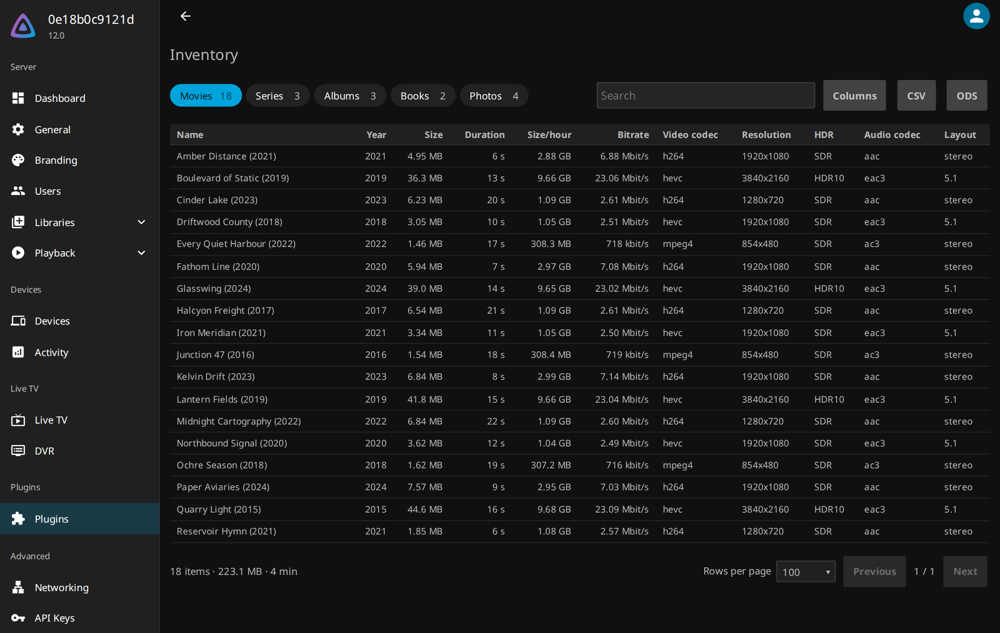
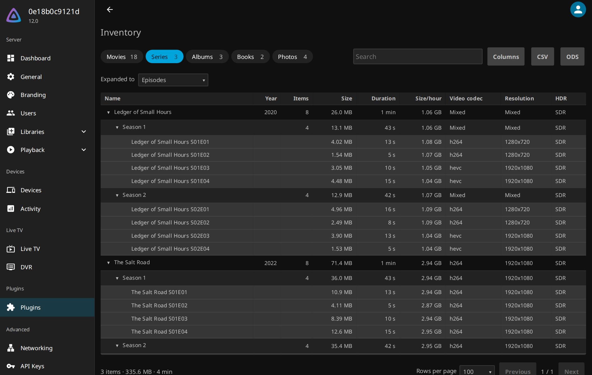

<div align="center">

<picture>
  <source media="(prefers-color-scheme: dark)" srcset=".github/assets/jellyfin_inventory-logo-on-dark.svg">
  <source media="(prefers-color-scheme: light)" srcset=".github/assets/jellyfin_inventory-logo-on-light.svg">
  
</picture>

<a href="#installation"><picture><source media="(prefers-color-scheme: dark)" srcset="https://shieldcn.dev/badge/Jellyfin-12.0%2B.svg?variant=secondary&amp;mode=dark&amp;logo=jellyfin"></picture></a>
<a href="https://github.com/ivenos/jellyfin_inventory/releases"><picture><source media="(prefers-color-scheme: dark)" srcset="https://shieldcn.dev/github/downloads/ivenos/jellyfin_inventory.svg?variant=secondary&amp;mode=dark"></picture></a>
<a href="LICENSE"><picture><source media="(prefers-color-scheme: dark)" srcset="https://shieldcn.dev/badge/license-GPL_3.0.svg?variant=secondary&amp;mode=dark"></picture></a>

Inventory is a Jellyfin plugin that puts everything in your libraries into one sortable, searchable table in the dashboard, from a whole series down to a single episode. It shows where the space has gone and what your files are made of, and exports the result as a spreadsheet.




</div>

---

## Installation

Requires Jellyfin 12.0 or newer. On anything older the catalog stays empty.

Add the repository under Dashboard → Plugins → Repositories:

```
https://raw.githubusercontent.com/ivenos/jellyfin_inventory/main/manifest.json
```

Inventory then appears in the catalog under General. Restart the server after installing; the table is at Dashboard → Plugins → Inventory → Settings. A manual install is the zip from the [latest release](https://github.com/ivenos/jellyfin_inventory/releases/latest) unpacked into `config/plugins/Inventory/`.

## Columns

| Group | Columns |
| --- | --- |
| General | Name, Series, Season, Episode, Year, Library, Items, Container, Size, Duration, Size/hour, Bitrate, Date added, Path |
| Video | Video codec, Profile, Resolution, Height, Video bitrate, Framerate, Bit depth, HDR, Dolby Vision, Pixel format, Interlaced |
| Audio | Audio codec, Layout, Channels, Audio bitrate, Sample rate, Spatial, Audio tracks, Audio languages |
| Subtitles | Subtitle tracks, Subtitle languages |
| Playback | Last played, Last played (all users), Plays, Plays (all users), Fully played, Fully played by |

## API

Six endpoints under `/Inventory`, all requiring an administrator token. An API key carries no user, so the playback columns that are the caller's own are empty for one. `mediaType` names a tab, `level` one of the levels inside it; those and the column keys all come from `Schema`.

| Endpoint | Parameters | Answers with |
| --- | --- | --- |
| `GET Schema` | `culture` | The populated media types with their levels, every column, the page size, the interface strings and the culture they were answered in |
| `GET Items` | `mediaType`, `level`, `parentIds`, `columnLevel`, `search`, `sortBy`, `descending`, `startIndex`, `limit`, `culture` | One page of rows with the columns they are keyed by, how many rows there are in total, and the size and runtime behind them; `parentIds` returns the whole child set rather than a page |
| `GET Export` | `mediaType`, `level`, `columnLevel`, `format`, `search`, `sortBy`, `descending`, `culture` | Every matching row as a `csv` or `ods` file, less the ones a match above them already accounts for |
| `POST Columns` | `level`, and the column keys as a JSON array in the body | The stored selection |
| `POST Expand` | `mediaType`, `level` | The stored level |
| `POST PageSize` | `size` | The stored number of rows per page |

## License

Copyright © Iven Schlösser. Inventory is free software, licensed under the [GNU General Public License v3.0 only](LICENSE). You may use, modify and redistribute it. Anyone distributing a modified version must release it under the same license and make its source code available.

Inventory builds on the Jellyfin.Controller and Jellyfin.Model packages, licensed under the GNU General Public License v3.0 only.

Inventory is not affiliated with or endorsed by the Jellyfin project.
