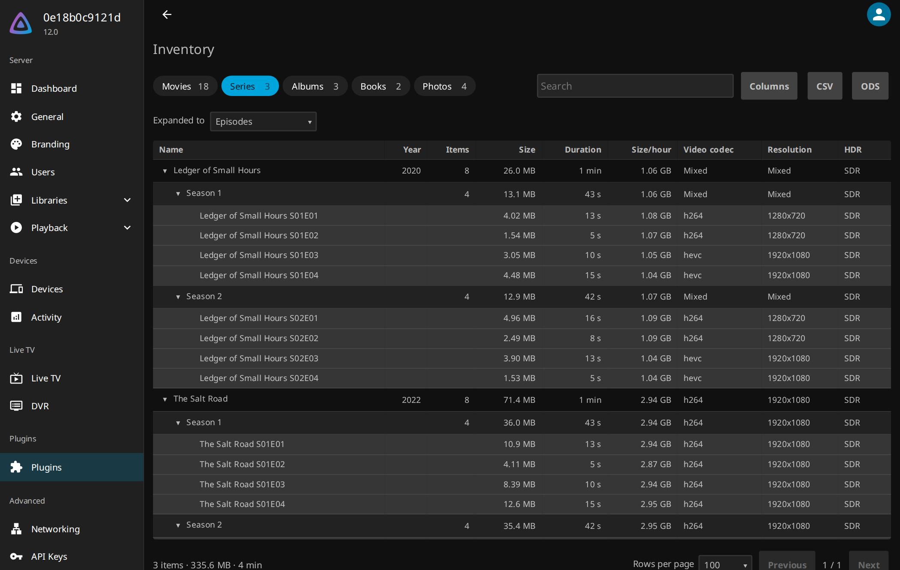

# Inventory

Jellyfin plugin that puts everything in your libraries into one table in the
dashboard, from a whole series down to a single episode. Sort it, search it,
choose the columns you want, and take the result out as a spreadsheet. It
answers what the library view leaves out: where the space has gone, and what
your files are actually made of.

<p>


</p>

## Install

Add the repository under Dashboard → Plugins → Repositories:

```
https://raw.githubusercontent.com/ivenos/jellyfin_inventory/main/manifest.json
```

Inventory then appears in the catalogue under General. Restart the server after
installing; the table is at Dashboard → Plugins → Inventory → Settings. A manual
install is the zip from the
[latest release](https://github.com/ivenos/jellyfin_inventory/releases/latest)
unpacked into `config/plugins/Inventory/`.

**Compatibility:** Jellyfin 12.0 or newer; on anything older the catalogue stays empty.

## Columns

| Group | Columns |
| --- | --- |
| General | Name, Series, Season, Episode, Year, Library, Items, Container, Size, Duration, Size/hour, Bitrate, Date added, Path |
| Video | Video codec, Profile, Resolution, Height, Video bitrate, Framerate, Bit depth, HDR, Dolby Vision, Pixel format, Interlaced |
| Audio | Audio codec, Layout, Channels, Audio bitrate, Sample rate, Spatial, Audio tracks, Audio languages |
| Subtitles | Subtitle tracks, Subtitle languages |
| Playback | Last played, Last played (all users), Plays, Plays (all users), Fully played, Fully played by |

## API

Six endpoints under `/Inventory`, all requiring an administrator token.
`mediaType` names a tab, `level` one of the levels inside it; those and the
column keys all come from `Schema`.

| Endpoint | Parameters | Answers with |
| --- | --- | --- |
| `GET Schema` | `culture` | The populated media types with their levels, every column, the page size, the interface strings and the culture they were answered in |
| `GET Items` | `mediaType`, `level`, `parentIds`, `columnLevel`, `search`, `sortBy`, `descending`, `startIndex`, `limit`, `culture` | One page of rows with the columns they are keyed by, how many rows there are in total, and the size and runtime behind them; `parentIds` returns the whole child set rather than a page |
| `GET Export` | `mediaType`, `level`, `columnLevel`, `format`, `search`, `sortBy`, `descending`, `culture` | Every matching row as a `csv` or `ods` file |
| `POST Columns` | `level`, and the column keys as a JSON array in the body | The stored selection |
| `POST Expand` | `mediaType`, `level` | The stored level |
| `POST PageSize` | `size` | The stored number of rows per page |

## Building

See [CONTRIBUTING.md](CONTRIBUTING.md).

## Licence

[GPL-3.0](LICENSE)
